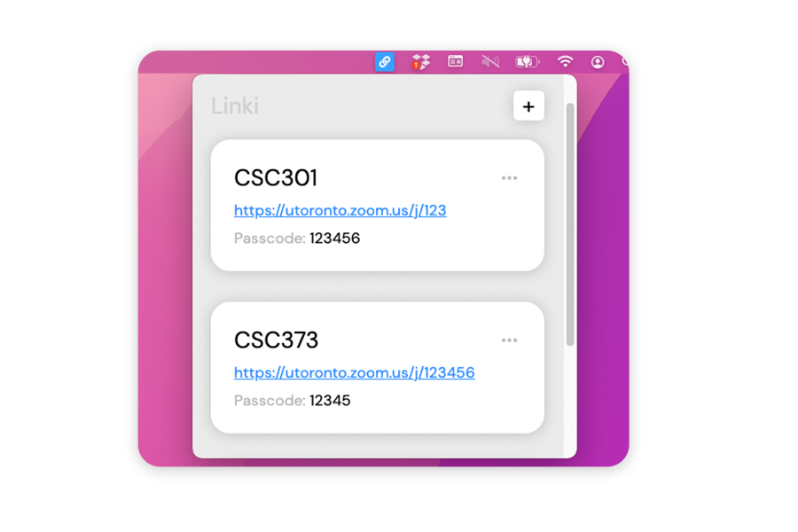

<h3 align="center">
Linki is a free menubar app for quick access to your recurring meeting links
</h3>
 

&nbsp;&nbsp;&nbsp;&nbsp; 

 

 

Easy access to all your recurring links from your menubar!
> Tired of having to check the syllabus or course website every time you want 
> the Zoom link? Linki puts them all in one place.

Linki is completely free and cross-platform on macOS and Windows
> Download it using the links above!

### Made with

- [Electron](https://www.electronjs.org)
- [menubar](https://github.com/maxogden/menubar)
